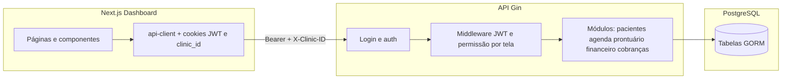

# Mapa do sistema — operação por clínica

Este documento descreve a **visão geral do monorepo Clínicas**, com foco no **dia a dia da clínica** (usuários logados, dados isolados por tenant, agenda, pacientes, financeiro da unidade, equipe e gestão de perfis **dentro da clínica**).

**Fora do escopo aqui:** a **administração da plataforma** (rotas `GET/POST/PUT/... /admin/*` e ` /api/v1/admin/*`): planos globais, telas do catálogo da plataforma, assinaturas administrativas, usuários da plataforma, auditoria operada só por admin, retenção em massa, etc. Essas rotas exigem `middleware.AutenticadoAdmin()` na API.

---

## 1. Visão geral da arquitetura

| Camada | Tecnologia | Pasta principal |
|--------|------------|-----------------|
| API REST | Go (Gin), GORM, JWT | `API/` |
| Front web | Next.js (App Router), React, TanStack Query, Axios | `FRONT/src/` |
| Banco | PostgreSQL (via GORM `AutoMigrate` + seeds) | configurado em `API/database/` |

- **Monorepo:** backend e frontend convivem no mesmo repositório; variáveis de ambiente podem estar na **raiz** (`.env`) ou em `API/`, conforme o `main` carrega `godotenv`.
- **Documentação OpenAPI/Swagger:** exposta pela API em `/swagger/*any` (útil para detalhes de contratos).

---

## 2. Conceito central: multiclínica e isolamento

- Cada **clínica** é um tenant lógico. Várias rotas usam o contexto da clínica ativa.
- O **JWT** inclui claims como `clinica_id`, `tipo_usuario_id`, `papel`, `especialidade`.
- O front envia o cabeçalho **`X-Clinic-ID`** (cookie `clinic_id`) nas requisições autenticadas, além de **`Authorization: Bearer`**.
- Endpoints **`/auth/minhas-clinicas`** e **`/auth/trocar-clinica`** permitem ao usuário alternar a clínica ativa quando possui vínculo em mais de uma.

---

## 3. Autenticação e perfil (comum a todas as telas)

| Recurso | Rota API | Uso no front |
|---------|----------|--------------|
| Login | `POST /login` | Página `(auth)/login` |
| Alterar senha | `PUT /auth/alterar-senha` | Perfil / fluxo de segurança |
| Esqueci senha | `POST /auth/esqueci-senha` | Recuperação |
| Redefinir senha | `POST /auth/redefinir-senha` | Link por token |
| Permissões do menu | `GET /auth/minhas-permissoes-rotas` | Layout do dashboard: monta itens permitidos ao **tipo de usuário** |
| Clínicas do usuário | `GET /auth/minhas-clinicas` | Seletor / contexto |
| Trocar clínica | `POST /auth/trocar-clinica` | Contexto ativo |

O menu lateral do **dashboard** não é fixo: ele depende das **rotas de API** liberadas ao `tipo_usuario_id` do token (ver `FRONT/src/hooks/use-minhas-permissoes-rotas.ts` e `computeTelasLiberadas`).

---

## 4. RBAC e permissões por tela

- Middleware **`VerificaPermissaoTipoUsuario`** protege a maioria dos grupos autenticados (exceto health, login, webhooks).
- Na **clínica**, donos (`DONO` / `ADM_GERAL` da clínica) podem gerir **tipos de usuário** e **associação tipo ↔ tela** em **`/clinicas/gestao/*`** (subgrupo com `middleware.ExigePapeis(rbac.PapelDono, rbac.PapelADMGeral)`).
- O front trata **“Perfis e telas”** (`/gestao`) como item extra para papéis dono / admin geral da clínica, alinhado ao que a API retorna em `minhas-permissoes-rotas`.

---

## 5. Mapa do front — área operacional `(dashboard)`

Layout: `FRONT/src/app/(dashboard)/layout.tsx` (menu condicionado às permissões).

| Rota Next (path) | Nome no menu (resumo) | APIs / conceito principal |
|------------------|------------------------|---------------------------|
| `/dashboard` | Dashboard operacional | `GET /dashboard`, `.../agendamentos-hoje`, `.../estatisticas`, `.../metricas-operacionais` |
| `/agenda` | Agenda médica | `GET/POST /clinicas/agenda`, `PUT .../status`, `.../profissional`, `.../liberar-cobranca`, `GET .../horarios-disponiveis` |
| `/atendimentos` | Meus atendimentos | Fluxo ligado a agenda/atendimento (permissão rota estilo `/clinicas/atendimentos`) |
| `/pacientes` | Pacientes | `GET/POST /pacientes`, `GET /pacientes/:cpf`, `PUT ...` |
| `/pacientes/[id]/prontuario` | Prontuário do paciente | `GET/POST /clinicas/prontuarios`, `PUT /clinicas/prontuarios/:id`, atestados, componentes clínicos (anamnese, odontograma, mapa de dor, etc.) |
| `/procedimentos` | Procedimentos | `GET/POST/PUT/DELETE /procedimentos` (+ reativar) |
| `/convenios` | Convênios | `GET/POST/PUT/DELETE /convenios`, vínculos `.../procedimento` |
| `/financeiro` | Gestão financeira | `GET /financeiro/abrir`, `GET/POST /clinicas/financeiro`, `GET .../financeiro/resumo`, custos fixos |
| `/financeiro/recebimentos` | Recebimentos (gateway) | `GET /clinicas/cobrancas/relatorio-financeiro` |
| `/pagamentos` | Pagamentos | `GET /clinicas/cobrancas/fila`, `POST /clinicas/cobrancas`, `GET .../:id` |
| `/equipe` | Equipe | `GET/POST/PUT/DELETE /usuarios`, horários, `POST /clinicas/usuarios`, `GET /clinicas/tipos-usuario` |
| `/gestao` | Perfis e telas | `GET/POST/PUT/DELETE /clinicas/gestao/*` (telas, tipos, permissões) |
| `/perfil` | Minha conta | Dados do usuário / senha |
| `/trocar-senha` | Troca obrigatória | Layout enxuto; segurança da conta |

Rotas de **marketing / landing** e páginas em `(auth)` (login, esqueci senha, etc.) ficam fora do grupo dashboard, mas são a porta de entrada.

---

## 6. Mapa da API — tudo que interessa à operação da clínica

Grupos principais **sem** o prefixo `/admin`:

### 6.1 Dashboard

- `GET /dashboard`
- `GET /dashboard/agendamentos-hoje`
- `GET /dashboard/estatisticas`
- `GET /dashboard/metricas-operacionais`

### 6.2 Usuários (equipe e cadastros)

- `POST/GET /usuarios`, `GET/PUT/DELETE /usuarios/:id`, `PUT .../reativar`
- `GET/PUT /usuarios/:id/horarios`
- **`POST /clinicas/usuarios`** — cria usuário **na clínica** do contexto (fluxo dono/equipe)

### 6.3 Pacientes

- `POST/GET /pacientes`, `GET /pacientes/:cpf`, `PUT/DELETE/PUT-reativar /pacientes/...`

### 6.4 Clínica (núcleo do tenant)

Prefixo **`/clinicas`** (atenção à **ordem** das rotas no Gin: rotas literais como `/agenda` antes de `/:id`):

| Caminho | Função resumida |
|---------|-----------------|
| `POST/GET /clinicas` | Criar e listar clínicas acessíveis |
| `GET/PUT/DELETE/PUT-reativar /clinicas/:id` | CRUD da unidade |
| `GET/PUT /clinicas/:id/configuracoes` | Configurações da clínica |
| `GET /clinicas/tipos-usuario` | Tipos de usuário **da clínica** |
| `GET/POST /clinicas/financeiro`, `GET .../resumo` | Lançamentos e resumo |
| `GET/POST/PUT /clinicas/custos-fixos` | Custos fixos |
| `POST/GET /clinicas/agenda` | Agendamentos |
| `PUT /clinicas/agenda/:id/profissional` | Troca de profissional |
| `PUT /clinicas/agenda/:id/status` | Status do agendamento |
| `PUT /clinicas/agenda/:id/liberar-cobranca` | Libera cobrança |
| `GET /clinicas/agenda/horarios-disponiveis` | Slots livres |
| `GET /clinicas/cobrancas/fila`, `POST /clinicas/cobrancas`, `GET .../:id`, `GET .../relatorio-financeiro` | Fila e cobranças (gateway Asaas no backend) |
| `GET/POST /clinicas/atestados` | Atestados médicos |
| `GET/POST/PUT /clinicas/prontuarios` | Prontuário eletrônico |
| **`/clinicas/gestao/*`** | Gestão **interna** da clínica: telas, tipos de usuário, permissões tipo↔tela (apenas dono / ADM geral da clínica) |

### 6.5 Convênios e procedimentos

- **`/convenios`:** cadastro, procedimentos vinculados, reativação.
- **`/procedimentos`:** catálogo por clínica, preço, duração, convênio opcional.

### 6.6 Financeiro (abertura de módulo)

- `GET /financeiro/abrir` — usado pelo front para “abrir” o módulo conforme permissão/auditoria.

### 6.7 Webhook de pagamento (infra da clínica, não UI)

- `POST /webhooks/asaas/pagamentos` — atualização de cobranças (sem JWT de usuário; validação própria do serviço).

### 6.8 Saúde

- `GET /health` — ping de banco para load balancer / monitoramento.

---

## 7. Modelo de dados (entidades migradas — visão de domínio)

Definidas em `API/database/migration.go` (ordem de dependência). Relacionadas à **operação da clínica**:

- **Núcleo:** `Clinica`, `ClinicaConfiguracao`, `Usuario`, `UsuarioClinica`, `TipoUsuario`, `Permissao`, `PermissaoTela`, `UsuarioHorario`
- **Assinatura / plano (contexto comercial da unidade):** `Assinatura`, `Plano`, `PlanoTela`, `Tela` — o catálogo de telas também alimenta o RBAC do menu
- **Atendimento:** `Paciente`, `Procedimento`, `Convenio`, `ConvenioProcedimento`, `Agenda`, `AgendaProcedimento`, `StatusAgendamento`
- **Prontuário e documentos:** `ProntuarioRegistro`, `AtestadoMedico`
- **Financeiro da clínica:** `LancamentoFinanceiro`, `CustoFixo`, `CobrancaConsulta`
- **Conformidade:** `AuditLog`, `TokenRedifinicao`, `Funcionalidade`

---

## 8. Pastas úteis no código (só operação + compartilhado)

| Pasta | Conteúdo típico |
|-------|-----------------|
| `API/controllers/` | Handlers HTTP por domínio |
| `API/services/` | Regras de negócio |
| `API/repositories/` | Acesso a dados |
| `API/models/` | Entidades e DTOs |
| `API/middleware/` | JWT, permissões |
| `API/internal/rbac/` | Papéis e constantes |
| `API/internal/audit/` | Auditoria |
| `FRONT/src/app/(dashboard)/` | Páginas operacionais |
| `FRONT/src/services/api-client.ts` | Cliente HTTP centralizado |
| `FRONT/src/hooks/` | Hooks de dados (agenda, auth, atestados, equipe, etc.) |
| `FRONT/src/components/` | UI incluindo formulários clínicos (anamnese, odontograma, mapa de dor) |
| `FRONT/src/lib/` | Helpers (atestado Brasil, serialização odontograma/mapa de dor, impressão) |

---

## 9. Diagrama lógico (fluxo resumido)

---

## 10. O que não está neste mapa (admin plataforma)

Rotas sob **`/admin`** e **`/api/v1/admin`**: gestão global de planos, telas, assinaturas, usuários da plataforma, plano da clínica pelo admin, auditoria administrativa, jobs de retenção, etc. O front correspondente costuma estar em **`FRONT/src/app/(admin)/admin/`**.

Para detalhes finos de payloads e códigos HTTP, use o **Swagger** da API ou os arquivos de controller/service no repositório.

---

*Documento gerado a partir da estrutura do repositório (rotas, migrations e layout do dashboard). Ajuste este arquivo quando novos módulos forem adicionados.*
